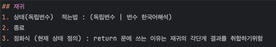

# 풀이 규칙  1,2,3
문제풀이는 123이라는 법칙으로 시간을 조절하면 좋겠다.
3- 30분동안 손도 못댔다면 해당문제를 풀 준비가 안돼있는 것이다. 추가적인 공부를 하거나 다른사람 풀이를 보자.
1 - 1시간동안 풀었는데 효율성이 안나온다면 다른 알고리즘이나 자료구조 적용을 고려해보자. 생각이 나지 않는다면 다 른사람 풀이를 보자.
2- 2시간동안 엣지케이스를 못찾았다면 다시풀거나 다른사람 풀이를 보자

## 해부방법
1. 요구사항과 독립변수(독립변수|한국어로 정의) 
2. 요구사항별 풀이 흐름
3. 풀이 흐름별 모듈화구현(자바의 정석 fully)

## 재귀  
1. 상태(독립변수)  적는법 : (독립변수 | 변수 한국어해석)
2. 종료
3. 점화식 (현재 상태 정의) : return 문에 쓰는 이유는 재귀의 각단계 결과를 취합하기위함 

## 재귀의 기본적인 cs 구조

