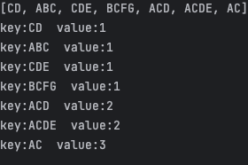

지금 문제  :

#### 재귀과정에서의 오류 
가능한 경우를 만든다 ACD를 생성했으면 ADC로는 생성하지 못하게  
근데 일단 카운트가 잘 안된다  => 이건 시발 ......재귀 과정을 뜯어봐야될 듯

일단 ABCD가 있다고 하면
ABCD
BCD
CD
이렇게 되는데 이게 맞음

ABCD

BCD 
CD 
이게 맞는데? => 지우는게 맞지않나... 근데 복사해서 쓰면 왜 그렇게 되는지는 적어놓ㅇ아햐 된다 
ArrayList<String> middelSet= new ArrayList<>(char_orders);
middelSet.remove(i);

복사해서 하는가 아니면 준거에서 그냥 배버리는가? => 이건 잘 안되는데 

##### length 제한 두면 remove 쓰면 안됨 remove 한개 length에 계속 반영됨 
그리고 내가 분명 고객 호출 수가 2 이하인 것은 없앴는데 ... 1도 출력이 되네  => 리스트를 순회하면서 지우데 legnth 기준이면 당연히 뒤에 부분은 잘ㄹ림   => 해결 add로 해결

-> filter로 하는 방법 찾기 

### 답지 (개어려움 괜히 level3이 아니야...)
핵심은 Set입니다 
=> 장기간의 분석필요  ㄹㅇ ㅈㄴ 어려움 
