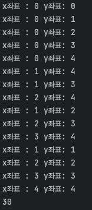

재귀 먼저하고 업그레이드로 Dp로 가야됨 

요구사항 : 거치는 것의 합이 가장 큰 경우 찾기  
독립 변수 찾기: 거처가는 인덱스(x,y좌표), 거쳐가는 숫자의 합 
=> 여기서 숫자의 합은 인덱스 값에 따라서 달라져서 종속적임 

#### 내풀이 - 합을 비교 => 이것도 한번 해봐야 내 단점을 안다 => DB시간에 해보기
1) 상태 : sum,  arr[Y][X] | => 수정사항 : sum - 거쳐가는 숫자의 합의 최댓값 
2) 종료 : y > 주어진 y의 최대, (x가 y번쨰 배열에서 초과과 될떄 => 이거는 y가+1되면 x는 무조건 늘어나서 상관없다)
3) 점화식 : 다음 sum += Math.max(sum(arr[y+1][x]) , sum(arr[y+1][x+1]))  

#### 답지풀이 - 최댓값만 사용 
1) 상태 : arr[y][x] | x,y증가를 통해 이동할 수 있는 것 중 최댓값 
2) 종료 : y > 주어진 y의 최대(층)
3) 점화식 : 다음 arr[y][x] = max(arr[y+1][x], arr[y+1][x+1]) => 이거 다 합치면된다

##### 살펴볼 차이점 : 나는 sum의 최대를 비교을 했고 답지는 요소의 최대를 비교해서 넘김
1. sum : 변수를 저장하는 sum이 같이 들어가면서 문제가 된다
   1. 재귀는 돌아가는데 sum도 계속 들어가 있어서 최대가 +된다
   2. 근데 return에 넣으면 계속 더해지지않고 마지막에 한번 나옴 
      1. 왜이러지?.. sum을 누적을 시켜야 하나의 여부로 해야되
      2. 근데 sum을 없애기엔 거쳐가는 숫자의 합의 최댓값을 표현하기 위해서 필요함 

2. 이중 리스트인 mem  => 왜 문제가 되는거지?
   1. 일차원 배열로하면 문제가 되는 이유? 
3. 재귀가 돌아가는 프로세스

