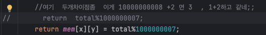

단계별로 하는걸 모르겠다 
단계별로 구현하고 
테스트하는게 필요할 것 같은데 - 재귀가 이게 가능한지는 모르겠다

재귀가 잘 들어갔는지 trace하는건 필요한 것 같은데 테스트 케이스가 없으니깐 
재귀 약한 test케이스만 trace하는법 익혀야함 

재귀 - 잘 동작하는지 trace 필요합니다 
왜 그렇게 나오는지 분석해야되고

지금 문제는 2,2가 처음 좌표가 1,1 일때 적용되는거여서 틀림
처음 좌표가 0,0이면 puddle은 1,1이 맞다 

#### 시작 
1) 요구사항 
2) 독립변수파악

#### 내가푼것  => 효율성에서 시간초과
1) 상태 : (x,y) , visitcount | x,y이동좌표와 visicount: 이동횟수
2) 종료 :  웅덩이, 경로이탈시 아무것도 return x,  학교도착시 visitcount저장 
3) 점화식 
   1) 오른: (x+1, y), visit_count+1
   2) 아래: (x, y+1), visit_count+1

#### 정답 풀이 
1) 상태 : (x,y) | 격자의 (x,y)에서 출발하여 학교까지 가는 최단 경로의 개수 
2) 종료 : 웅덩이일떄 0, 이닽시 0, 목적지 도착시 1(유의미한 경로)
3) 점화식 : (x,y) = (x+1, y) + (x, y+1)  | 오른족 아래 최단경로 개수 합친거 

#### mem
상태기반, 그냥 그떄 그 상태를 기록해야됨 
해당 죄표에 모든 경로의 경우의 수 == 상태를 기록 

#### DP를 어떻게 적용해야할까 => 상태 바탕으로
1) mem : 각각 격자(x,y)당 최단경로의 수 저장
=> 재귀 구조에 대한 이해도가 낮아서 어떤걸 mem에 저장 하는지 모르는 것 같기도함 
재귀는 그냥 왔던대로 무르면서 실행한다고 생각?
뭔가 명확하게 해야되는데...

possibleCourse_mem를 통해 (3,3)에 다시 왔을떄 가능한 경로를 그대로 복사하게?
가능한 경로를 어떻게 알아임마 3,3에 다시 왔을때 이게 가능한 경로를 추가하는 과정이 완전히 끝났는지 어떻게알아 
=> 

DP가 가능하게 재귀를 짜야하나? 
근데 이걸 어떻게 하지 => 상태는 요구사항과 직접적으로 연결되있어야 하나? 
내가 푼것도 말은 되는데 일단 return이 void여서 특정 값을 return 하지 않음

## 고쳐야할검 
1) Return값이 void이면 -> 변수에 점화식넣고 최종결과를 return에 넣는다 
2) 상태는 문제의 요구사항과 독립변수를 반영할 수 있도록
내 풀이는 유연하지 못해 DFS이기도하고..연관성을 찾기 어렵지..DP로 전환 하기가 너무 어렵다
만약 DFS를 재귀로 바꿀 수 있다면 좋은 발견일텐데.. ======'''이건내일 해보고  

//여기  두개차이점좀  이게 10000000008 +2 면 3  , 1+2하고 같네;;
//        return  total%1000000007;
return mem[x][y] = total%1000000007;