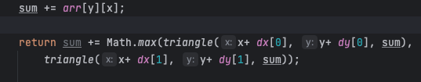
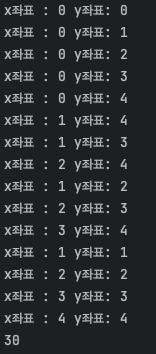

재귀 먼저하고 업그레이드로 Dp로 가야됨 

요구사항 : 거치는 것의 합이 가장 큰 경우 찾기  
독립 변수 찾기: 거처가는 인덱스(x,y좌표), 거쳐가는 숫자의 합 
=> 여기서 숫자의 합은 인덱스 값에 따라서 달라져서 종속적임 

#### 내풀이 - 합을 비교 => 이것도 한번 해봐야 내 단점을 안다 
1) 상태 : sum += arr[Y][X] | => 수정사항 : sum - 거쳐가는 숫자의 합의 최댓값 
2) 종료 : y > 주어진 y의 최대, (x가 y번쨰 배열에서 초과과 될떄 => 이거는 y가+1되면 x는 무조건 늘어나서 상관없다)
3) 점화식 : 다음 sum += Math.max(sum(arr[y+1][x]) , sum(arr[y+1][x+1]))  

=> 이러면... 왜  return이 아니라 코드 중간에 sum을 넣으면 안되지? 
=> 이러면 max 값을 더하는게 아니라 arr[y][x]값 다 더해놓고(이건 확실) 
=> 근데 sum이 특정 시점에 들어가서 각 상황에따른 sum이 다르고 -> sum에 max 값을 추가로 더한다(그래서 값이 지랄 맞음)

#### 답지풀이 - 최댓값만 사용 
1) 상태 : arr[y][x] | x,y증가를 통해 이동할 수 있는 것 중 최댓값 
2) 종료 : y > 주어진 y의 최대(층)
3) 점화식 : 다음 상태 :  max(arr[y+1][x], arr[y+1][x+1]) => 나중에 이거 다 합치면된다

##### 재귀에 DP를 어떻게 적용해야 될까? => 반복되는 상태 찾기
{8,1,0}에서 1에 도달했을 max를 mem해야된다 1에 도착하는 과정이 너무 반복된다 
문제 : 이걸 하기 위해서는 trace해야되는데 trace가 내가 생각하는거랑 기계가 실제 돌아가는거랑 다를 수 있음

##### 살펴볼 차이점 : 나는 sum의 최대를 비교을 했고 답지는 요소의 최대를 비교해서 넘김
1. sum : 변수를 저장하는 sum이 누적되고 점화식이 아닌 다른부분에서 무조건 들어가서 틀림
2. 이중 리스트인 mem  
   1. 일차원 배열로하면 문제가 되는 이유? 
   2. 이차원배열을 사용한 이유가 있을까? 
      1. {8,1,0}에서 1에 도달했을 max를 mem해야된다 1에 도착하는 과정이 너무 반복된다 
      2. 반복되는 상태를 파악해야될듯 
3. 재귀가 돌아가는 프로세스
   1. 이걸알아야 되는 것 같은데 이걸 다 그려보기에는 시간이 없어
      1. 그럼 재귀를 어떻게 trace할 수 있을까? 일단 종료 조건에 도달해야 특정 값이 나오는건 맞는데 이걸 다 할 순 없고 
      2. 근데 또 안하자니 어느 과정에서 반복이 일어나는지 알 수가 없고 
   2. 

   

# 배운점 
1) 상태는 독립변수로만 구성
2) 점화식은 return 으로 다음 상태를 넘겨준다
3) mem적용은 반복되는 상태를 파악한 후에 -> 파악해야되나? 
   1) 내 생각은 mem은 상태의 형태를 따른다 그래도 가면 될듯 
   2) 상태가 반복되네? -> DP 적용해볼까? -> 상태 형식으로 mem
