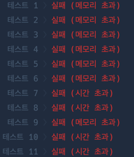

재귀를 어떨 떄 적용하면 좋을지 생각해봐야된다 : 시간 초과가 너무 많이 나온다 
그리고 재귀를 사용하는게 좋다고 생각했을때 재귀를  어떻게 해야될까 

# 정렬 
요구사항 : 정수를 이어붙여 만들수 있는 가장 큰수 구하기 => 정렬 
변수 : 정렬을 통해 재배치되는 인덱스
=> Comparator가 Wrapper 자료형이여서 boxed해야되는데 이걸 어떻게 하지?  
=> 왜 시발 이거 Wrapper class인데 
추가 요구사항 30, 3일때 303이아니라 330으로 만들어야된다 => 하나고정한채로 비교할려고했는데 두개 자리수가 다를때는 어지러움
=> 두개를 그냥 만들고 비교하자!!
=> 0000일때 케이스도 생각해야됨 => 정규표현식 지렸다....이건 절대 생각못해 

요구사항 : 정수를 이어붙여 만들수 있는 가장 큰수 구하기 => 가능한 조합을 구해서 최대를 반환한다
변수 : numbers 원소들의 조합
## 재귀가 꼭 필요할까 생각해보자  => 메모리 초과 
상태 : 현재숫자조합, 배열 numbers[], number에 있는 원소수
종료 : numbers.길이가 0일때 종료한다 
재귀 : 다음 숫자조합 = (현재숫자조합 + 추출한 numbers원소),  추출된 원소 제외한 numbers

# 답지 - 그냥 조합해서 비교한다 